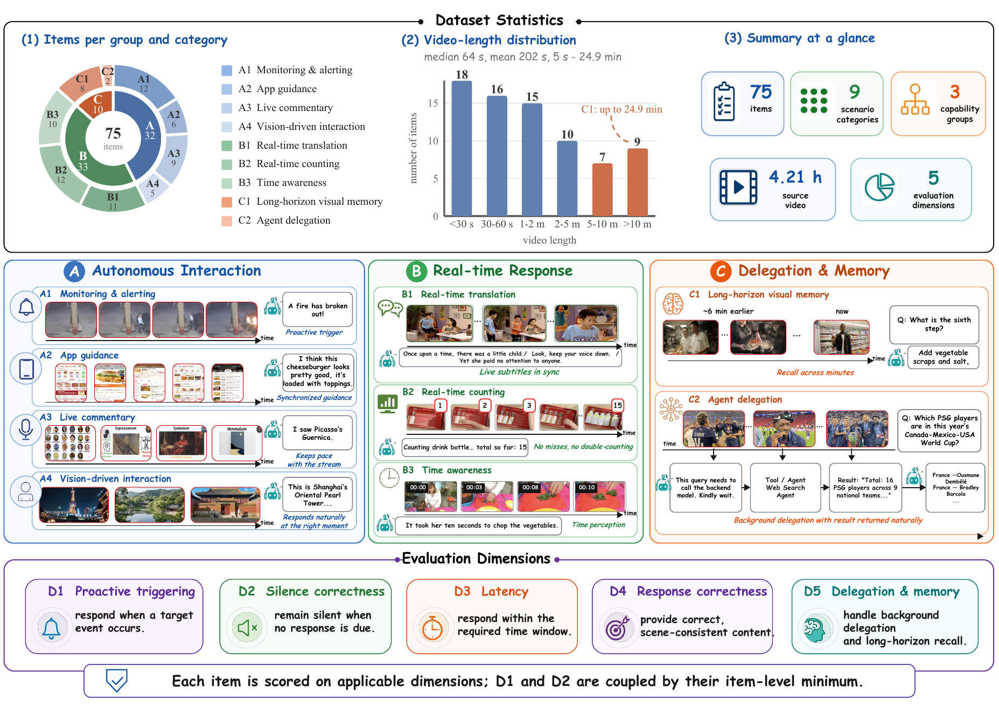
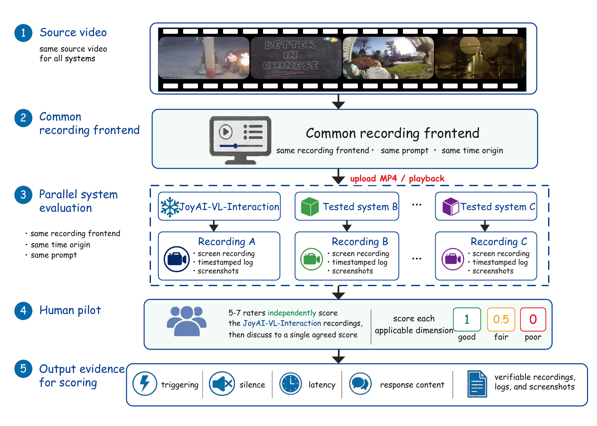
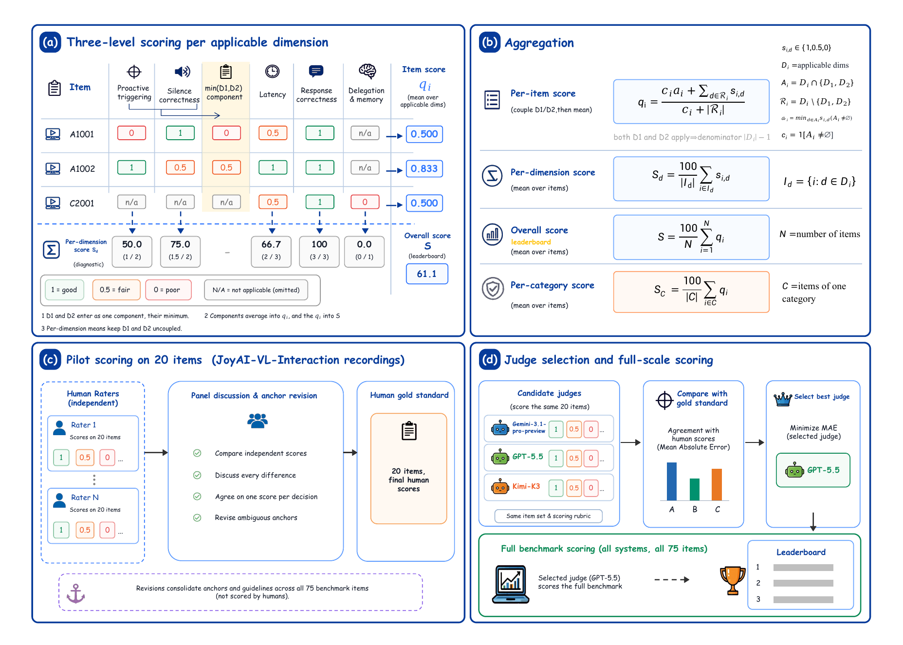
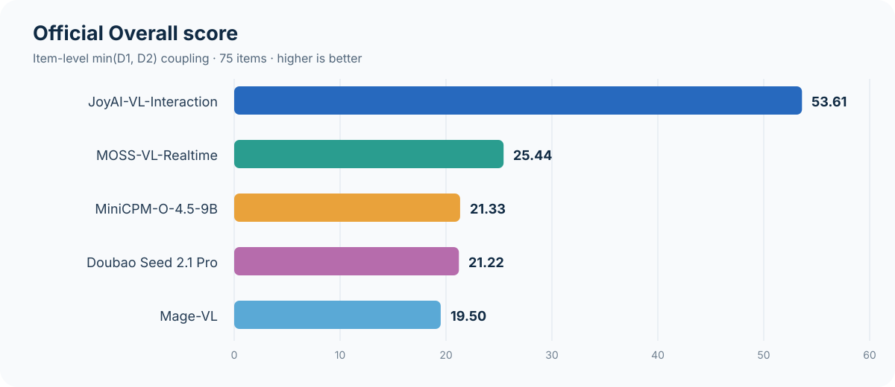
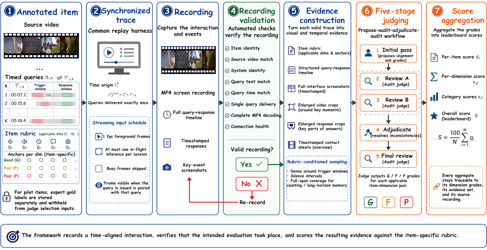

<div align="center">

# SVI-Bench

### Evaluating Human-Perceived Interaction Trajectories in Streaming Video Systems

**SVI-Bench** evaluates *when* a vision-language system speaks, *when* it stays
silent, *how quickly* it responds, *what* it says, and *what it remembers*.
**InteractFlow** is the reproducible recording-and-judging pipeline behind the
benchmark.

[](#benchmark-at-a-glance)
[](#leaderboard)
[](#human-judge-alignment)
[](#installation)
[](#installation)
[](LICENSE)

[Project Page](https://yidanhai.github.io/SVI-Bench/) ·
[Dataset](https://huggingface.co/datasets/Danmel02/SVI-bench) ·
[Overview](#overview) · [Benchmark](#benchmark-design) ·
[Leaderboard](#leaderboard) · [Quick start](#quick-start) ·
[Data](DATA.md) · [Data Terms](DATA_TERMS.md) · [InteractFlow Skill](#codex-skill) ·
[Third-party notices](THIRD_PARTY.md)

</div>

> [!IMPORTANT]
> This repository contains the current runnable InteractFlow pipeline. The
> benchmark workbook and 71 source videos are distributed through the
> [SVI-Bench Hugging Face dataset](https://huggingface.co/datasets/Danmel02/SVI-bench).
> Model weights, generated recordings, and credentials are never committed here.

## Overview

Offline video QA asks whether a model can answer a question about a clip.
Streaming interaction is stricter: the model must continuously observe a live
timeline, react at the right moment, avoid unsolicited speech, meet a latency
budget, and retain information across long sessions. SVI-Bench makes those
behaviors separately observable and traceable to synchronized evidence.

<p align="center">
  
</p>

### What is released here

- **A benchmark protocol:** 75 items, nine scenarios, five anchored dimensions,
  and an item-level score that couples triggering with silence.
- **A common recording harness:** the same source video, prompt, query schedule,
  foreground sampling rule, frontend, and time origin for every system.
- **Native system integration:** purpose-built systems retain their stateful
  realtime interfaces; the observable task is standardized, not the backend.
- **Evidence-first judging:** every accepted recording is converted into
  timestamped visual and temporal evidence, then graded with a fixed five-stage
  Judge.
- **Operational reliability:** bounded retries, resumable campaigns, artifact
  hashes, backend identity checks, and completion audits.

## Benchmark at a glance

<table>
  <tr>
    <td align="center"><strong>75</strong><br>items</td>
    <td align="center"><strong>9</strong><br>scenarios</td>
    <td align="center"><strong>3</strong><br>capability groups</td>
    <td align="center"><strong>5</strong><br>dimensions</td>
    <td align="center"><strong>4.21 h</strong><br>source video</td>
    <td align="center"><strong>71</strong><br>unique videos</td>
    <td align="center"><strong>272</strong><br>item-dimension anchors</td>
  </tr>
</table>

- Video duration ranges from **5 seconds to 24.9 minutes** (median: 64 s).
- The formal evaluation contains **102 timed query rounds per system**, including
  16 multi-round items.
- Five deployed configurations produce **375 accepted recordings** and
  **1,875 Judge-stage predictions**.
- Every applicable item-dimension pair has an explicit good/fair/poor anchor,
  represented numerically as `1 / 0.5 / 0`.

## Benchmark design

### Three capability groups, nine scenarios

| Group | ID | Scenario | What it tests | Items |
|---|---:|---|---|---:|
| Autonomous interaction | A1 | Monitoring & alerting | Detect an event and alert at the right moment | 12 |
|  | A2 | App guidance | Guide an on-screen task in sync with the current view | 6 |
|  | A3 | Live commentary | Narrate changing content without falling behind | 9 |
|  | A4 | Vision-driven interaction | Respond naturally when the scene calls for it | 5 |
| Real-time response | B1 | Real-time translation | Translate continuously at the pace of the stream | 11 |
|  | B2 | Real-time counting | Count events or objects without misses or duplicates | 12 |
|  | B3 | Time awareness | Act on elapsed time and scheduled intervals | 10 |
| Delegation & memory | C1 | Long-horizon visual memory | Recall details from minutes earlier | 8 |
|  | C2 | Agent delegation | Delegate a background task and return its result naturally | 2 |

### Five independently observable dimensions

| Dimension | Measures | Full-credit behavior | Applicable items |
|---|---|---|---:|
| **D1 — Proactive triggering** | Whether the system speaks when a target event occurs | Trigger once, within the item-defined window | 55 |
| **D2 — Silence correctness** | Whether it avoids speech when no response is due | No barge-in or spurious utterance | 49 |
| **D3 — Latency** | Delay from an event/query to valid output | Meet the item-defined response window | 73 |
| **D4 — Response correctness** | Factual, scene-consistent, task-compliant content | Cover the expected information without fabrication | 75 |
| **D5 — Delegation & memory** | Background delegation and long-horizon recall | Delegate/recall correctly without breaking interaction | 20 |

The scenario taxonomy says **what interaction is tested**. The five dimensions
say **how the resulting behavior is scored**. Inapplicable dimensions are
recorded as N/A and excluded; a required behavior that the evaluated system
fails to produce receives zero.

## Fair, synchronized recording

<p align="center">
  
</p>

Every system receives the same observable task contract:

| Fixed across systems | Retained per system |
|---|---|
| Source video and local-MP4 playback | Native stateful session protocol |
| Instruction and timed query schedule | Model serving stack and inference engine |
| Recording frontend and common time origin | Native memory and response mechanism |
| Nominal 1-fps foreground schedule | Text or audio query interface where required |
| One in-flight frame inference; busy frames skipped | System-specific adapter and output parser |
| Item anchors and aggregation rule | Deployed configuration defaults |

The released workflow uploads **local MP4 files** through the configured WebUI;
it does not convert benchmark inputs to RTSP. Each item starts a fresh session.
A healthy silence, late answer, or wrong answer is retained as model behavior;
network, identity, capture, or protocol failures are treated as technical errors
and retried within a bounded policy.

## Scoring: coupling triggering and silence

D1 and D2 are complementary. If scored as unrelated global averages, a model
that almost never speaks can collect a high D2 score, while a model that speaks
constantly can exploit D1. SVI-Bench therefore couples them **inside each item,
before any averaging across items**.

For item `i`, let `D_i` be its applicable dimensions and
`s_{i,d} ∈ {1, 0.5, 0}`. The D1/D2 component is their item-level minimum when
both apply, or the lone score when only one applies. That component is averaged
with applicable D3–D5 scores to obtain `q_i`. The only leaderboard score is:

$$
S = \frac{100}{N}\sum_{i=1}^{N} q_i, \qquad N=75.
$$

When all five dimensions apply:

$$
q_i = \frac{\min(D1_i,D2_i)+D3_i+D4_i+D5_i}{4}.
$$

This is **not** `min(mean(D1), mean(D2))`, and it is not the raw mean of five
global dimension scores. The implementation writes the official value as
`benchmark_score`; `dimension_mean_score` remains diagnostic only.

The public workbook expresses anchors as G/F/P. Manifest construction maps
these deterministically to the validated Judge protocol's G/S/B labels
(`F → S`, `P → B`), which then map to `1 / 0.5 / 0` in code.

<p align="center">
  
</p>

## Leaderboard

The following results use a frozen five-stage GPT-5.5 Judge over five deployed
end-to-end configurations. They compare complete systems under the same
observable protocol, not isolated model weights under hardware-controlled
conditions.

<p align="center">
  
</p>

| Rank | Deployed configuration | Items | **Overall S ↑** | S without D3 ↑ *(diagnostic)* |
|---:|---|---:|---:|---:|
| **1** | **JoyAI-VL-Interaction** | 75 | **53.61** | 39.67 |
| 2 | MOSS-VL-Realtime | 75 | 25.44 | 26.33 |
| 3 | MiniCPM-O-4.5-9B | 75 | 21.33 | 20.44 |
| 4 | Doubao Seed 2.1 Pro | 75 | 21.22 | 29.44 |
| 5 | Mage-VL | 75 | 19.50 | 21.78 |

`S without D3` first applies the same item-level D1/D2 coupling and then omits
D3. It is a latency sensitivity analysis, **not a second leaderboard**.

<details>
<summary><strong>Scenario-level diagnostic results</strong></summary>

Category scores average the same coupled item scores within each scenario.
They diagnose behavior and do not define an additional ranking.

| System | A1 | A2 | A3 | A4 | B1 | B2 | B3 | C1 | C2 |
|---|---:|---:|---:|---:|---:|---:|---:|---:|---:|
| JoyAI-VL-Interaction | **65.28** | **41.67** | **44.44** | 46.67 | **36.36** | **48.61** | **67.08** | **68.75** | **75.00** |
| Doubao Seed 2.1 Pro | 45.83 | 22.22 | 12.96 | 40.00 | 0.00 | 12.50 | 30.83 | 16.67 | 0.00 |
| Mage-VL | 18.06 | 5.56 | 20.37 | **50.00** | 6.06 | 22.22 | 37.92 | 8.33 | 0.00 |
| MOSS-VL-Realtime | 37.50 | 8.33 | 37.04 | **50.00** | 0.00 | 22.22 | 40.83 | 18.75 | 0.00 |
| MiniCPM-O-4.5-9B | 23.61 | 33.33 | 22.22 | 6.67 | 18.18 | 18.06 | 36.67 | 12.50 | 0.00 |

</details>

<details>
<summary><strong>Raw dimension means (diagnostic only)</strong></summary>

| System | D1 | D2 | D3 | D4 | D5 |
|---|---:|---:|---:|---:|---:|
| JoyAI-VL-Interaction | **29.09** | 55.10 | **82.88** | **50.67** | **27.50** |
| Doubao Seed 2.1 Pro | 17.27 | **91.84** | 2.74 | 40.00 | 7.50 |
| Mage-VL | 15.45 | 81.63 | 14.38 | 25.33 | 7.50 |
| MOSS-VL-Realtime | 22.73 | 59.18 | 23.97 | 32.67 | 15.00 |
| MiniCPM-O-4.5-9B | 11.82 | 80.61 | 21.92 | 26.00 | 2.50 |

The `17.27 / 91.84` D1/D2 split for Doubao illustrates the silence-reward
failure mode: sparse output can look strong under D2 alone. These raw means are
never substituted for the official item-coupled Overall score.

</details>

## Human-Judge alignment

The Judge was selected on a 20-item human pilot covering all nine scenarios,
then frozen before full-benchmark scoring. Expert grades never enter formal
Judge prompts, manifests, requests, or evidence.

| Scope | Labels | MAE ↓ | Exact ↑ | Within one level ↑ | Macro-F1 ↑ | Quadratic κ ↑ |
|---|---:|---:|---:|---:|---:|---:|
| **All dimensions** | **71** | **0.0986** | **83.10%** | **97.18%** | **0.7762** | **0.7803** |
| D1 — Proactive triggering | 14 | 0.1786 | 64.29% | 100.00% | 0.4444 | 0.4444 |
| D2 — Silence correctness | 11 | 0.0909 | 90.91% | 90.91% | 0.8693 | 0.6452 |
| D3 — Latency | 20 | 0.0750 | 90.00% | 95.00% | 0.5370 | 0.5763 |
| D4 — Response correctness | 20 | 0.1000 | 80.00% | 100.00% | 0.7475 | 0.8148 |
| D5 — Delegation & memory | 6 | 0.0000 | 100.00% | 100.00% | 0.6667 | 1.0000 |

MAE is measured on the `1 / 0.5 / 0` scale. The pilot contains
JoyAI-VL-Interaction recordings; cross-system human annotation remains future
work for measuring Judge generalization across response styles and latency
regimes.

## InteractFlow

InteractFlow turns an annotated item into a verified, auditable benchmark score:

<p align="center">
  
</p>

1. **Load an annotated item** with source video, horizon, timed queries, and
   item-specific anchors.
2. **Replay a synchronized stream** with one in-flight foreground inference and
   no frame backlog.
3. **Capture the interaction** as MP4, timestamped events, responses, and key
   screenshots.
4. **Validate the recording** against task, source, query, backend, connection,
   and decode contracts.
5. **Construct evidence** with rubric-aware temporal sampling and full-session
   coverage.
6. **Run five-stage judging:** first pass → review A → review B → adjudication →
   final review.
7. **Aggregate scores** into per-item, diagnostic dimension/category, and
   official Overall results.

Recording and scoring are intentionally decoupled. A valid trace can be
inspected or rejudged without rerunning the evaluated model; a technically
invalid trace is returned to recording and is never silently counted as a model
failure.

## Quick start

### Installation

Prerequisites:

- Python 3.10+
- Node.js 18+
- `ffmpeg` and `ffprobe`
- Chromium
- `cloudflared` when the WebUI must reach a locally launched adapter

```bash
git clone https://github.com/YidanHAI/SVI-Bench.git
cd SVI-Bench

python3 -m venv .venv
source .venv/bin/activate
python -m pip install --require-hashes -r requirements.lock
npm ci
npx playwright install chromium
```

`requirements.txt` lists the direct Python dependencies. The checked-in
`requirements.lock` pins their complete resolved dependency graph; regenerate
it with the command recorded in that file when the direct requirements change.

MOSS and Mage checkpoints use separate serving environments. See
[`moss_mage_api_service/README.zh-CN.md`](moss_mage_api_service/README.zh-CN.md).

### Configure credentials and endpoints

```bash
cp .env.example .env
chmod 600 .env
```

Populate `.env` locally. Credentials are read only from environment variables or
this private file; never add them to JSON configuration, shell commands, logs,
or Git. Machine-specific campaign changes belong in the ignored
`config/recording_campaign.local.json`, selected with
`VL_INTERACTION_CAMPAIGN_CONFIG`.

### Prepare external data

Follow [DATA.md](DATA.md) to place the workbook and source MP4 files, then build
the derived task manifest and MiniCPM query-audio cache:

```bash
hf download Danmel02/SVI-bench --repo-type dataset \
  --revision DATASET_COMMIT --local-dir data

python scripts/build_tasks_from_xlsx.py \
  --xlsx data/SVIBench-开源表.xlsx \
  --sheet 题目池 \
  --video-dir data/interaction-75题 \
  --video-map data/media_index.jsonl \
  --out data/recording_tasks_75.jsonl \
  --report data/recording_tasks_75.report.json

python scripts/prepare_minicpmo_query_audio.py \
  --tasks data/recording_tasks_75.jsonl \
  --out-dir data/minicpmo_query_audio
```

### Validate, run, and monitor

Validation is local: it does not start recording or call the Judge API.

```bash
bash scripts/run_all.sh validate
```

Start the complete recording → validation → evidence → Judge workflow:

```bash
bash scripts/run_all.sh start
```

Monitor or stop the supervisor through the same supported interface:

```bash
bash scripts/run_all.sh status
bash scripts/run_all.sh stop
```

Interrupted work resumes from completed, validated task and stage artifacts.
For a genuinely independent run, choose new `PIPELINE_OUTPUT_ROOT`
and `JUDGE_OUTPUT_ROOT` values instead of editing completed artifacts.

<details>
<summary><strong>Run recording and judging separately</strong></summary>

Recording only:

```bash
bash scripts/record_all.sh dry-run
bash scripts/record_all.sh start
bash scripts/record_all.sh status
```

Judge an accepted recording campaign:

```bash
export JUDGE_RECORDING_RUN=outputs/recording_campaign/runs/RUN_ID
bash scripts/judge_all.sh validate
bash scripts/judge_all.sh start
bash scripts/judge_all.sh status
```

You may alternatively set `JUDGE_RECORDING_INDEX` to a validated recording
manifest. Set exactly one recording source.

</details>

## Codex Skill

The repository includes an agent-facing InteractFlow Skill in
[`skills/interactflow/`](skills/interactflow/). It performs a secret-safe setup
check, prepares derived inputs, launches only the supported entrypoints, and
keeps monitoring until the completion audit passes or a genuine user-actionable
blocker is found.

Ask Codex:

```text
Use $interactflow to validate and start the complete SVI-Bench workflow.
```

Or invoke its deterministic front door directly:

```bash
python3 skills/interactflow/scripts/interactflow.py check
python3 skills/interactflow/scripts/interactflow.py start
python3 skills/interactflow/scripts/interactflow.py status
```

## Outputs and completion criteria

Generated artifacts live under `outputs/` and remain ignored by Git:

```text
outputs/
├── recording_campaign/
│   └── runs/RUN_ID/
└── judge_campaign/
    └── runs/RUN_ID/
        ├── manifests/
        ├── models/
        ├── campaign_state.json
        └── leaderboard.json
```

A formal run is complete only when all of the following hold:

- 375/375 recordings pass validation;
- 1,875/1,875 model–item–stage predictions succeed;
- all five model summaries contain 75 valid items and zero failed tasks;
- the combined `leaderboard.json` exists;
- blindness, provenance, evidence-integrity, and resume audits pass.

## Repository layout

| Path | Purpose |
|---|---|
| [`config/`](config/) | Formal campaign and five-system registry |
| [`scripts/run_all.sh`](scripts/run_all.sh) | End-to-end recording-then-Judge entrypoint |
| [`scripts/record_all.sh`](scripts/record_all.sh) | Recording-only lifecycle |
| [`scripts/judge_all.sh`](scripts/judge_all.sh) | Judge-only lifecycle |
| [`prompts/`](prompts/) | Frozen prompts for the five Judge stages |
| [`docs/`](docs/) | GitHub Pages project site, figures, and protocol notes |
| [`tests/`](tests/) | Offline protocol, scoring, resume, blindness, and audit tests |
| [`moss_mage_api_service/`](moss_mage_api_service/) | Optional local MOSS/Mage serving adapter |
| [`skills/interactflow/`](skills/interactflow/) | Codex operational Skill |
| [`third_party/`](third_party/) | Pinned JoyAI adapter source and provenance |

## Tests

The complete offline suite does not call external model APIs:

```bash
npm test
```

Dependency audits run in CI and can also be reproduced locally:

```bash
npm audit --omit=dev --audit-level=moderate
uvx pip-audit -r requirements.lock --disable-pip
```

Preview the static Project Page locally:

```bash
python3 -m http.server 8000 --directory docs
```

## Citation

If you use SVI-Bench or InteractFlow, please cite the accompanying manuscript:

```bibtex
@misc{lin2026svibench,
  title  = {SVI-Bench: Evaluating Human-Perceived Interaction Trajectories
            in Streaming Video Systems},
  author = {Jianan Lin and Yidan Huang and Xiaoyi Qiao and Dongyi Lv and
            Yicheng Wang and Shi Suo and Shiying Fan and Yifei Li and
            Dingyu Yao and Chenxu Yang and Junhao Zhou and Chuanyu Qin and
            Qingyi Si and Nan Duan and Jiaqi Wang},
  year   = {2026},
  url    = {https://github.com/YidanHAI/SVI-Bench}
}
```

## License

The code in this repository is released under the
[Apache License 2.0](LICENSE). Benchmark media and annotations are distributed
separately under the terms stated in the dataset repository. Third-party
components retain their own terms as listed in [THIRD_PARTY.md](THIRD_PARTY.md).
